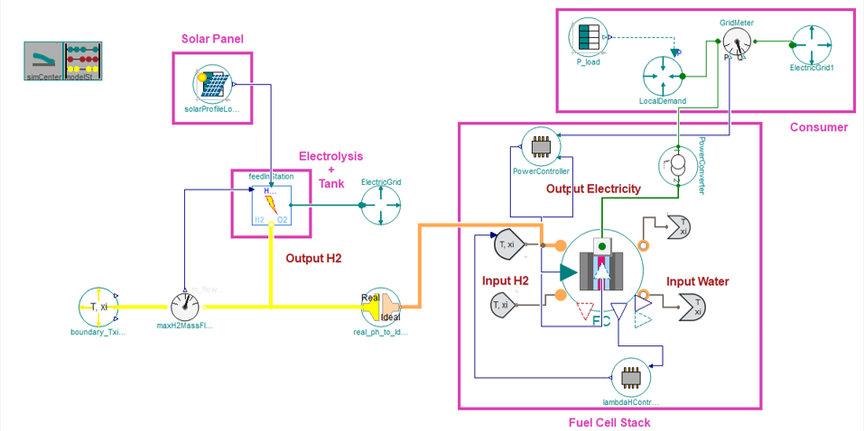

# Hy4GreenIT
#### Description: 

Hy4GreenIT = Hydrogen for Green IT

Simulation model of a hydrogen-based Green IT facility.

#### Goal:

In short, the goal of this work has two phases:

First phase:

* To establish a simulation to better predict **under which situation** is **how much computing resource** with **how many renewable energies** possible.

Second phase:

* To connect **optimization** frameworks with Modelica models.

#### Author: 

Zizhe Wang, 

Software Technology Group, 

Faculty of Computer Science, TU Dresden

zizhe.wang@tu-dresden.de

## Environment:

Dymola > 2021

* Dymola, Dynamic Modeling Laboratory, is a complete tool for modeling and simulation of integrated and complex systems for use within automotive, aerospace, robotics, process and other applications.

[TransiEnt Library](https://github.com/TransiEnt-official/transient-lib) > 2.0.0

* The TransiEnt library is written in the Modelica modeling language and allows simulations of integrated energy networks with high share of renewable energies.

[Clara Library](https://github.com/ClaRaLibrary/ClaRa) ≥ 1.8.0

* Modelica library for simulation of Clausius-Rankine (ClaRa) cycles in power plants

[TILMedia Library](https://github.com/ClaRaLibrary/TILMedia) ≥ 1.8.0

* Modelica library with thermophysical properties of fluids and solids (Used for ClaRa library)

---

This model has been tested in following environments:
`
Dymola = 2023
TransiEnt = 2.0.2
Clara = 1.8.0
TILMedia ClaRa = 1.8.0
`

#### How to Open the Model

1. Load `package.mo` file
2. The package Hy4GreenIT will be loaded with two files, the file `Hy4GreenIT` is the simulation model, another one is the modified adapter

## Main Components:

1. Solar Panel

2. Electrolysis + Hydrogen Tank

3. Adapter

4. Fuel Cell Stack

5. Consumer (IT Container)



### 1. Solar Panel

This sub-component uses this component from the TransiEnt library:

* `TransiEnt.Producer.Electrical.Photovoltaics.PVProfiles.SolarProfileLoader`

This component loads PV profiles from csv files.

The sub-component "Solar Panel" defines the value of electricity generated from solar energy, which uses:

* original data for 2015 (from 50HzNKZ, AmprionNKZ, TennetNKZ, TransnetNKZ) meassured every 15min, scaled by installed power (from BNAEEG).

### 2. Electrolysis + Tank

This sub-component uses this component from the TransiEnt library:

* `TransiEnt.Producer.Gas.Electrolyzer.Systems.FeedInStation_Storage`

This component represents a feed in station where hydrogen is produced with an electrolyzer, stored in an adiabatic storage and fed into a natural gas grid. The storage can by bypassed and the hydrogen is fed directly into the grid.

* Functions of ports
  * upper port (`P_el_set`): 
    * Input for the set value for the electric power
  * left port (`m_flow_feedIn`): 
    * Input for the possible feed-in mass flow into the natural grid etc
  * right port (`epp`): 
    * Electric power port for the electrolyzer
    * In this model: it defines the frequency of the grid
  * bottom port (`gasPortOut`): Outlet of the hydrogen
    * Output is defined as real gas with `h`, `p`, `xi`, `m_flow` as parameters
      * `h`: specific enthalpy
      * `p`: pressure
      * `xi`: mass fraction
      * `m_flow`: mass flow rate

### 3. Adapter

Adapter has been self-modified because the **output of electrolyzer is real gas with 4 parameters (`h`, `p`, `xi`, `m_flow`) and input of fuel cell stack is ideal gas with 4 parameters (`T`, `p`, `xi`, `m_flow`).** This is no adapter which can transfer real gas with `h` to ideal gas with `T`.

Details about this issue please see: [Question/problem with gas types · Issue #7](https://github.com/TransiEnt-official/transient-lib/issues/7)

The main modification is the equation (line 86 - 107):

```Modelica
equation
  // _____________________________________________
  //
  //           Characteristic Equations
  // _____________________________________________

  gasPortIn.p=gasPortOut.p;
  gasPortIn.m_flow+gasPortOut.m_flow=0;

  //if noEvent(gasPortIn.m_flow>0) then
    gasPortIn.h_outflow=gasOut.h;
    gasPortOut.T_outflow=gasIn.T;

  //else
    //gasPortOut.h_outflow=inStream(gasPortIn.h_outflow);
  //end if;

  gasPortIn.xi_outflow=inStream(gasPortOut.xi_outflow);

  gasPortOut.xi_outflow=inStream(gasPortIn.xi_outflow);

 // gasIn.T=gasOut.T;
```

### 4. Fuel Cell Stack

This sub-component uses this component from the TransiEnt library:

* `TransiEnt.Components.Electrical.FuelCellSystems.FuelCell.SOFC`

This component models one SOFC-Cell Stack.

### 5. Consumer

This component loads load profiles from csv files.

The sub-component "Consumer" defines the value of electricity which a consumer consumes, which uses:

* Original data for 2012 for a typical household in Hamburg, meassured every 15min

## Problem and Further Steps

As of May 2023 this model works without errors. After simulation, the program shows the following messages.

```Modelica
Log-file of program ./dymosim

(generated: Mon Jun 19 14:40:55 2023)


dymosim started

... "Hy4GreenIT.Hy4GreenIT" simulating

... "dsin.txt" loading (dymosim input file)

... loading "default" from "C:/Program Files/Dymola 2023/Modelica/Library/TransiEnt 2.0.2/Tables/ambient/UndergroundTemperature_Duesseldorf_1m_2017.txt"

... loading "default" from "C:/Program Files/Dymola 2023/Modelica/Library/TransiEnt 2.0.2/Tables/electricity/ElectricityPrices_DayAhead_EPEX_Spot_2011.txt"

... loading "default" from "C:/Program Files/Dymola 2023/Modelica/Library/TransiEnt 2.0.2/Tables/electricity/REProfiles/Solar2015_Gesamt_900s.txt"

... loading "default" from "C:/Program Files/Dymola 2023/Modelica/Library/TransiEnt 2.0.2/Tables/electricity/ElectricityDemand_VDI4665_ExampleHousehold_RG1_HH_2012_900s.txt"

... "Hy4GreenIT.mat" creating (simulation result file)


Integration started at T = 0 using integration method DASSL

(DAE multi-step solver (dassl/dasslrt of Petzold modified by Dassault Systemes))


Integration terminated successfully at T = 86400

   CPU-time for integration                : 0.352 seconds

   CPU-time for one grid interval          : 0.704 milliseconds

   CPU-time for initialization             : 0.627 seconds

   Number of result points                 : 704

   Number of grid points                   : 501

   Number of accepted steps                : 2448

   Number of f-evaluations (dynamics)      : 4500

   Number of crossing function evaluations : 3829

   Number of Jacobian-evaluations          : 1241

   Number of model time events             : 3

   Number of input time events             : 0

   Number of state events                  : 98

   Number of step events                   : 0

   Minimum integration stepsize            : 1.2e-06

   Maximum integration stepsize            : 1.75e+04

   Maximum integration order               : 4

Calling terminal section

... "dsfinal.txt" creating (final states)


SUCCESSFUL simulation of Hy4GreenIT.Hy4GreenIT
```

### Problem

1. Fuel Cell Stack works not so realistic right now.
2. The values of each component should be modified with more detailed and specific data.

### Further Steps

1. The model can be refined with different components, data, use cases
2. The model can be connected to variable structure systems (VSS)
   * it means different modus could be turned on/off under different situations.
3. The model can be coupled with optimization frameworks
